# [atet](https://github.com/atet) / [learn](https://github.com/atet/learn) / [unity](https://github.com/atet/learn/tree/master/unity)

[](#nolink)

# Introduction to Unity

* Estimated time to completion: 15 minutes (after downloading required programs).
* This quick introduction to Unity is meant to cover only the absolute necessary material to get you up and running in a minimal amount of time.
* You are here because you want to use the Unity engine to make stand-alone mobile and/or desktop applications (games, productivity apps, etc.).
* We will be using Unity to make a simple Android application; advanced material is not covered here.

--------------------------------------------------------------------------------------------------

### Table of Contents

#### Introduction
* [0. Requirements](#0-requirements)
* [1. Installation](#1-installation)
* [2. New Unity Project](#2-new-unity-project)
* [3. Simple Application](#3-simple-application)
* [4. Playmode Test](#4-playmode-test)
* [5. Building for Android](#5-building-for-android)
* [6. Android Mobile Phone Installation](#6-android-mobile-phone-installation)
* [7. Playing Your First Android Application](#7-playing-your-first-android-application)
* [8. Experiment](#8-experiment)

#### Supplemental
* [Unity Pro Tips](#unity-pro-tips)

--------------------------------------------------------------------------------------------------

### 0. Requirements

* An Android mobile phone is required to test your application.
* This tutorial was developed on Microsoft Windows 10, Unity 2019.2.15f1, and Visual Studio Code 1.38.1
   * Different versions of Unity may have slightly different menu placement, menu names, etc.
   * Both Unity and Visual Studio Code is also available on Mac OS X and Linux


[Back to Top](#table-of-contents)

--------------------------------------------------------------------------------------------------

### 1. Installation

**Two separate programs must be installed: VSCode and Unity**

1. **Visual Studio Code** (a.k.a. VSCode)
   * Download and install Microsoft Visual Studio Code: <a href="https://code.visualstudio.com/" target="_blank">https://code.visualstudio.com/</a>
   * Remember where you installed VSCode.

[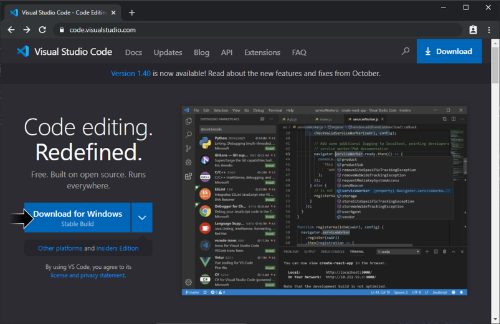](#nolink)

2. **Unity**
   * **Depending on your internet and computer speeds, downloading and installing Unity will take a while (20+ minutes)**
   * You must sign up for a free account with Unity (<a href="https://id.unity.com" target="_blank">https://id.unity.com</a>).
   * Download and install Unity Hub from: <a href="https://store.unity.com/download-nuo" target="_blank">https://store.unity.com/download-nuo</a>
   * Open Unity Hub and and sign into you Unity account.
   
   [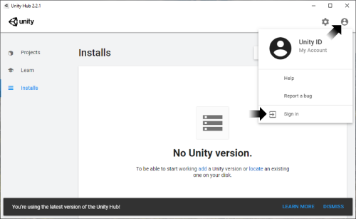](#nolink)
   
   * On the left-hand menu, select "Installs" then click on the blue "ADD" button on the right, choose "Unity 2019.2.15f1", and click on "NEXT". 

   [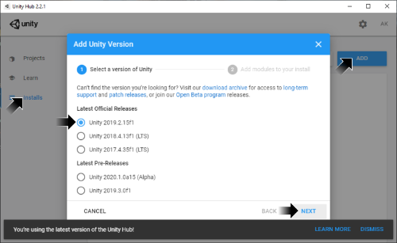](#nolink)

   * **You must select "Android Build Support"** and click "NEXT".

   [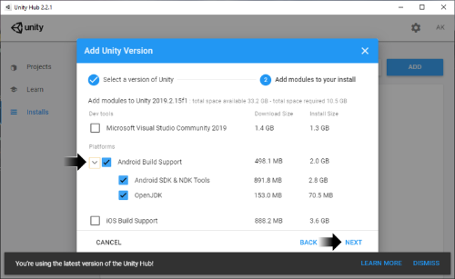](#nolink)

   * Review the license agreements to begin downloading and installation of Unity.
   * After Unity has been downloaded and installed, the installs screen will show a tiny Android icon next to the version that was installed.

   [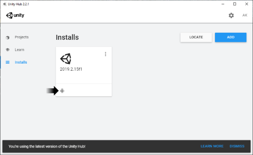](#nolink)

#### After downloading and installing Unity, VSCode, and registering for a Unity account, you should be able to play your first Android application within the next 15 minutes.

[Back to Top](#table-of-contents)

--------------------------------------------------------------------------------------------------

### 2. New Unity Project

* On the left-hand menu, select "Projects" then click on the blue "NEW" button on the right, and choose "2019.2.15f1".

[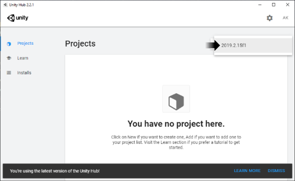](#nolink)

* Select 2D (default is a 3D project), choose your desktop as the location the project will be saved to (Unity will create a new folder), and click on "CREATE".
* Unity will take a few minutes to create your new empty project.

[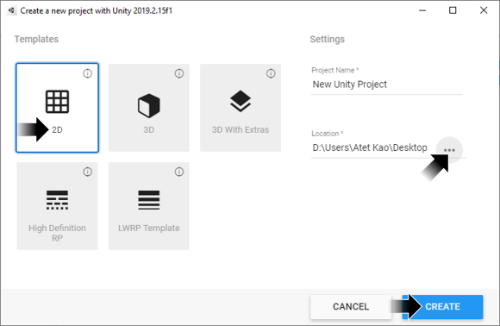](#nolink)

* Unity will take a few minutes to create your new empty project and you will be presented with the working environment.
* Don't worry about all the different window panes and menu options for now, just follow along with the instructions.

[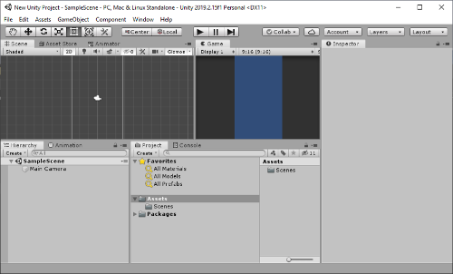](#nolink)

* **NOTE: We must configure Unity use VSCode as the external code editor**: Go to menu item Edit → Preferences... → External Tools and change "External Script Editor" to where you installed VSCode (navigate to where Code.exe is located).

[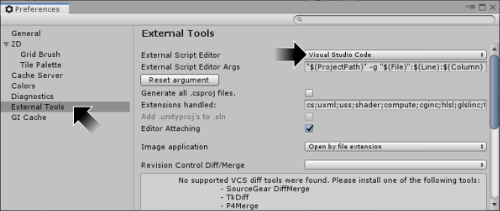](#nolink)

[Back to Top](#table-of-contents)

--------------------------------------------------------------------------------------------------

### 3. Simple Application

**Our application will be a button that increments the number shown above it when pressed. We can do this in three simple steps.**

1. **Create a Button**
   * On the bottom-left window pane, right-click on "SampleScene" and select GameObject → UI → Button.

   [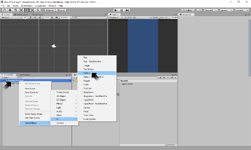](#nolink)

   * **_Where is the button?_** On the bottom-left, double-click on "Button" and the top-left window pane will zoom to where the button exists (Note: Just because you can't immediately see the object you just created doesn't mean it doesn't exist).

   [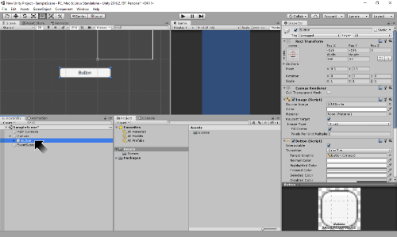](#nolink)

   * We must manually drag the button in the top-left window pane into where the white outline is. This brings the button into the actual view you will see when using the program (top-center window pane).

   [](#nolink)

2. **Create Text Box**
   * On the bottom-left window pane, right-click on "SampleScene" and select GameObject → UI → Text. If the text box doesn't appear within the white outline, drag it above the button.

   [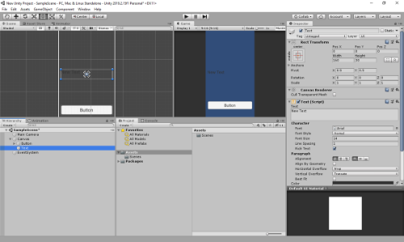](#nolink)

3. **Create Script**
   * On the bottom-left window pane, right-click on "SampleScene" and select GameObject → Create Empty.
   * On the bottom-left window pane, left-click on the newly created GameObject. Details of the GameObject are seen in the right-hand window pane, click on "Add Component" and in the small search bar, search for "script".

   [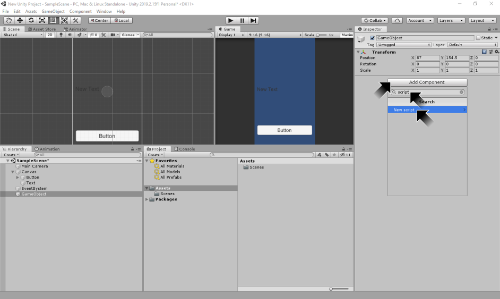](#nolink)

   * Click on New Script and name this new script "script". Click on "Create and Add".

   [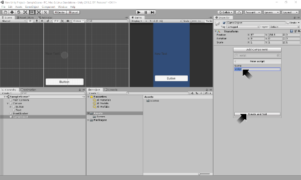](#nolink)

   * The script is now a component of the GameObject. We are going to double-click on this newly created script in the bottom-center window pane and it will open in VSCode.

   [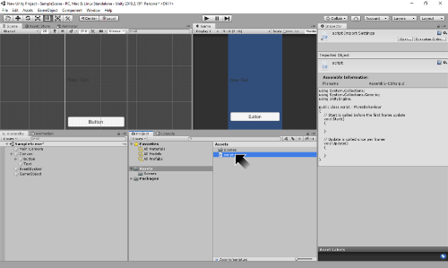](#nolink)

   * Unity will provide a template for every new script. If this is your first time opening a file in VSCode, it may download some extras to help read the specific programming alnguage you're using. Click on the "X" button on the bottom window pane once everything is finished.
   
   [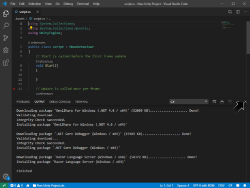](#nolink)
   
   * For now, just erase everything and copy-paste the code below and save the file (CTRL+S):

   ```cs
   using System.Collections;
   using System.Collections.Generic;
   using UnityEngine;
   using UnityEngine.UI;

   public class script : MonoBehaviour
   {
      public Button myButton;
      public Text myText;
      int myInt;
      void Start() // Start is called before the first frame update
      {
         myInt = 0;
         myButton.onClick.AddListener
         (
               delegate
               {
                  myInt += 1;
                  myText.text = myInt.ToString();
               }
         );
      }

      void Update() // Update is called once per frame
      {
         
      }
   }
   ```

   * Go back to Unity (Unity will take a moment to process the code you just saved in VSCode).
   * You will now see two new fields appear in the right-hand window pane called "My Button" and "My Text", you must manually drag-and-drop from the bottom-left pane the "Button" to "My Button" and "Text" to "My Text".

   [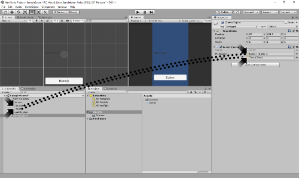](#nolink)

[Back to Top](#table-of-contents)

--------------------------------------------------------------------------------------------------

### 4. Playmode Test

* Change the following two settings before playmode testing:
   1. Go to menu Edit → Preferences... → Colors and change "Playmode tint" to a dark red.

   [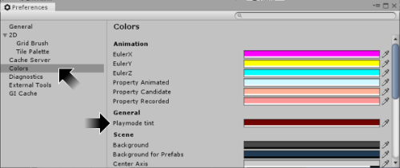](#nolink)
      
   2. Select "Maximize On Play" so that other window panes are hidden during playmode.
   
   [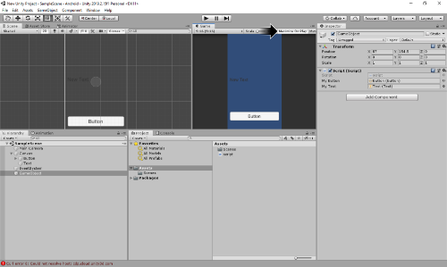](#nolink)

* You can start (and stop) playmode testing by clicking on the top-center ▶ (Play) button.

[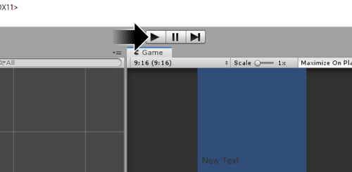](#nolink)

* Test you application by pressing the button and watching the number in the text box increment. Stop playmode when you are done and make sure to save your Unity project (CTRL+S).
* Don't worry about design elements right now (font sizes, etc.).

[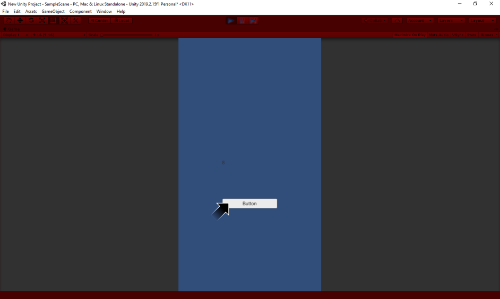](#nolink)

[Back to Top](#table-of-contents)

--------------------------------------------------------------------------------------------------

### 5. Building for Android

* Go to menu File → Build Settings... (CTRL+SHIFT+B)
* Select "Android" on the bottom-left pane and click "Switch Platform" on the bottom-right.
   * Unity will take a few minutes to process this change.
* Once it it done, the Unity icon will appear to the right of "Android".

[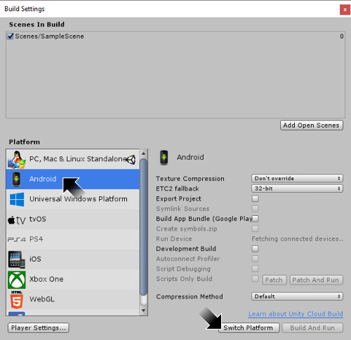](#nolink)

* Once Unity has been changed to build to the Android platform, click on "Build", name your file "test.apk", and navigate to your project folder and save the application.
   * Unity will take a few minutes to build your application to be ready for Android installation.

[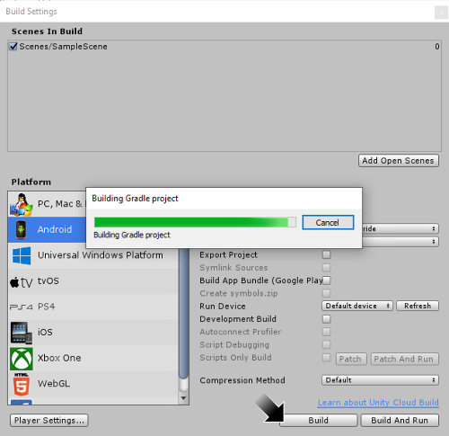](#nolink)

* Now you have the test.apk file needed to install your application on an Android device

[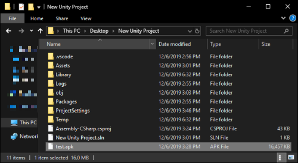](#nolink)

[Back to Top](#table-of-contents)

--------------------------------------------------------------------------------------------------

### 6. Android Mobile Phone Installation

**You should NEVER install unverified applications on your Android phone unless you have made them yourself and are confident that they do not contain viruses, etc. In the future, consider having test devices that are not linked to your social media, email accounts, etc.**

* Connect your Android phone to your computer to transfer the "test.apk" file over.
   * You may have to change the USB connection type to "Media (MTP)" in order to move files from your computer to your phone.
   * Through File Explorer on your computer, copy and paste "test.apk" on your phone (I made a folder named "Unity" to paste it into).
* Once the file transfer is complete, you can disconnect your phone from your computer.
* Android should have a program named "File Manager" or similar for you to explore files on your device. Navigate to where you placed "test.apk" on your phone, click on it to install.

[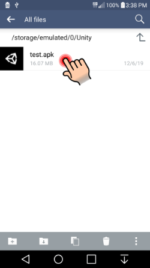](#nolink)

* By default, Android will prevent you from installing applications from unknown sources, we will temporarily allow this just to install our application.
   * Install will be blocked but you can click on "Settings" to go to "Security Settings" where you can "Allow" applications from unknown sources (in this case, this is the application _you_ just made).
   * Once in "Security Settings", go under "Phone Administration" and click on the checkbox for "Unknown sources".
   * **REMEMBER: Come back to settings to change this back to blocking application installs from unknown sources when you are done with this tutorial.**

[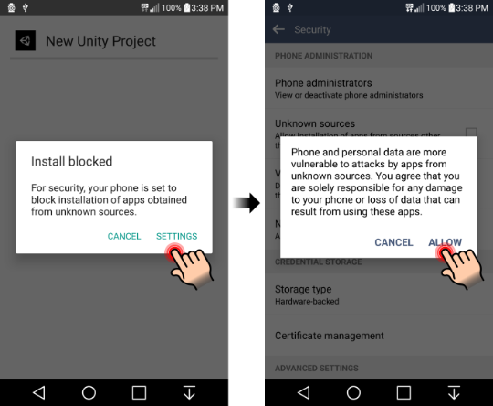](#nolink)

* Press the back key to go back to File Manager and click on test.apk and "INSTALL" again on the bottom-right.
* When the window about Play Protect pops up, select "INSTALL ANYWAYS".

[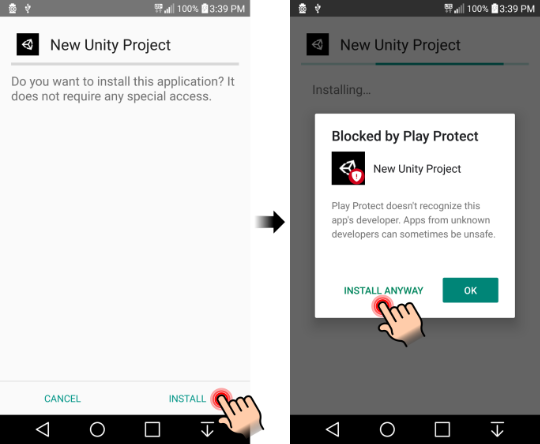](#nolink)

* Another popup window will ask for Play Protect scanning, you can ignore this and click on "DONT SEND".
* After a few moments, your test.apk is now installed as "New Unity Project".
* Click on OPEN on the bottom-right to launch your application.

[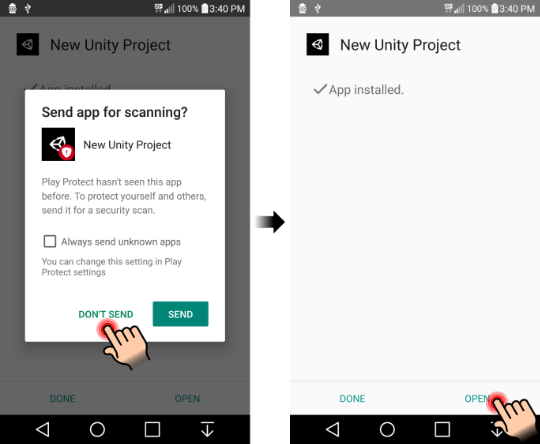](#nolink)

[Back to Top](#table-of-contents)

--------------------------------------------------------------------------------------------------

### 7. Playing Your First Android Application

* If you launched your application directly after installing, you'll get the Unity splash screen and then be presented with your application.
* Tap on the button and watch the numbers increment!
   * The button and text box may be tiny and you may have to be careful where you click.

[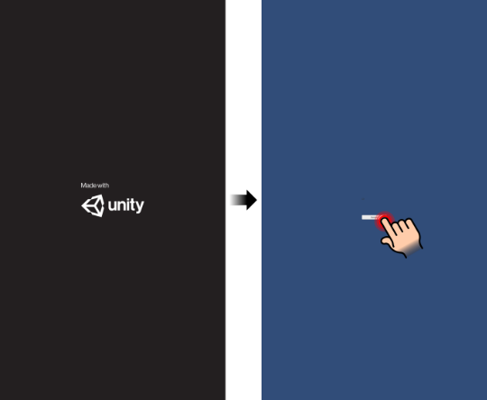](#nolink)

[Back to Top](#table-of-contents)

--------------------------------------------------------------------------------------------------

### 8. Experiment

* _Didn't like how small the button and text were?_ **Make them larger.**
* _Want more buttons and text boxes?_ **Make more!**
* You can make almost anything from games to productivity apps in Unity, see the following for more tutorials:

Description | Link
--- | ---
Unity Tutorials (Free) | <a href="https://learn.unity.com" target="_blank">https://learn.unity.com</a>
GameDevTV 2D Unity Course (Paid) | <a href="https://www.gamedev.tv/p/complete-unity-developer-2d" target="_blank">https://www.gamedev.tv/p/complete-unity-developer-2d</a>

[Back to Top](#table-of-contents)

--------------------------------------------------------------------------------------------------

### Unity Troubleshooting

* There may be major differences between different versions of Unity. If you upgrade the Unity engine during development, you could break your application.
* Q: I made some changes in Unity but it didn't seem to "Save" them.
   * A: Any changes when Unity is in "Playmode" are not saved. I would recommend the following two changes in the first part of [4. Playmode Test](#4-playmode-test).

[Back to Top](#table-of-contents)

--------------------------------------------------------------------------------------------------

### Unity Pro Tips

* **Clean Up**
   * If you make changes to this application, you should uninstall the current version first before installing the updated version.
   * On your Android device, go to Settings → DEVICE → Apps, find and select "New Unity Project" and click on "Uninstall".
   * You may want to erase the test.apk or start numbering these files with some sort of versioning system as you make changes, e.g. test_V2.apk or test_2019-12-08.apk
* Q: Why are we developing in Unity for an Android application, couldn't we have just used Android Studio?
   * A: Yes, but once you develop a project in Unity, it can also be built for iOS, PS4, Xbox One, Windows, MacOS, etc. 
* You will frequently go back and forth between manipulating objects in the Unity graphical user interface (GUI, referred to as "Unity") program and programming in Visual Studio Code (referred to as "VSCode").
* Unity is essentailly free for you learn and to make applications for yourself, but there may be some strings attached once you start making money from it: <a href="https://unity3d.com/legal/terms-of-service/software" target="_blank">https://unity3d.com/legal/terms-of-service/software</a>
* Drive: A colleague of mine (veteran software engineer) once told me while they were learning Unity:
> Unity is.. peculiar...


[Back to Top](#table-of-contents)

--------------------------------------------------------------------------------------------------

<p align="center">Copyright © 2019-∞ Athit Kao, <a href="http://www.athitkao.com/tos.html" target="_blank">Terms and Conditions</a></p>