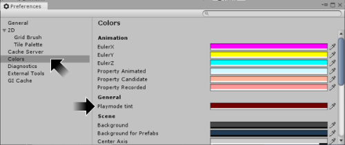
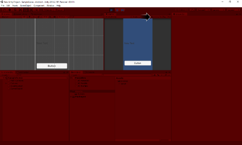
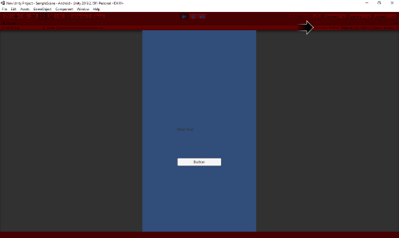

# [atet](https://github.com/atet) / [learn](https://github.com/atet/learn) / [unity](https://github.com/atet/learn/tree/master/unity)

[](#nolink)

# Introduction to Unity (INCOMPLETE)

* Estimated time to completion: 15 minutes (after downloading required programs).
* This quick introduction to Unity is meant to cover only the absolute necessary material to get you up and running in a minimal amount of time.
* You are here because you want to use the Unity engine to make stand-alone mobile and/or desktop applications (games, productivity apps, etc.).
* We will be using Unity to make a simple Android application; advanced material is not covered here.

--------------------------------------------------------------------------------------------------

### Table of Contents

#### Introduction
* [0. Requirements](#0-requirements)
* [1. Installation](#1-installation)
* [2. New Unity Project](#2-new-unity-project)
* [3. Simple Application](#3-simple-application)
* [4. Building for Android](#4-building-for-android)
* [5. Android Mobile Phone Installation](#5-android-mobile-phone-installation)
* [6. Playing Your First Android Application](#6-playing-your-first-android-application)
* [7. Experiment](#7-experiment)

#### Supplemental
* [Unity Pro Tips](#unity-pro-tips)

--------------------------------------------------------------------------------------------------

### 0. Requirements

* An Android mobile phone is required to test your application.
* This tutorial was developed on Microsoft Windows 10, Unity 2019.2.15f1, and Visual Studio Code 1.38.1
   * Different versions of Unity may have slightly different menu placement, menu names, etc.
   * Both Unity and Visual Studio Code is also available on Mac OS X and Linux


[Back to Top](#table-of-contents)

--------------------------------------------------------------------------------------------------

### 1. Installation

**Two separate programs must be installed: VSCode and Unity**

1. **Visual Studio Code** (a.k.a. VSCode)
   * Download and install Microsoft Visual Studio Code: <a href="https://code.visualstudio.com/" target="_blank">https://code.visualstudio.com/</a>
   * Remember where you installed VSCode.

[](#nolink)

2. **Unity**
   * **Depending on your internet and computer speeds, downloading and installing Unity will take a while (20+ minutes)**
   * You must sign up for a free account with Unity (<a href="https://id.unity.com" target="_blank">https://id.unity.com</a>).
   * Download and install Unity Hub from: <a href="https://store.unity.com/download-nuo" target="_blank">https://store.unity.com/download-nuo</a>
   * Open Unity Hub and and sign into you Unity account.
   
   [](#nolink)
   
   * On the left-hand menu, select "Installs" then click on the blue "ADD" button on the right, choose "Unity 2019.2.15f1", and click on "NEXT". 

   [](#nolink)

   * **You must select "Android Build Support"** and click "NEXT".

   [](#nolink)

   * Review the license agreements to begin downloading and installation of Unity.
   * After Unity has been downloaded and installed, the installs screen will show a tiny Android icon next to the version that was installed.

   [](#nolink)

#### After downloading and installing Unity, VSCode, and registering for a Unity account, you should be able to play your first Android application within the next 15 minutes.

[Back to Top](#table-of-contents)

--------------------------------------------------------------------------------------------------

### 2. New Unity Project

* On the left-hand menu, select "Projects" then click on the blue "NEW" button on the right, and choose "2019.2.15f1".

[](#nolink)

* Select 2D (default is a 3D project), choose your desktop as the location the project will be saved to (Unity will create a new folder), and click on "CREATE".
* Unity will take a few minutes to create your new empty project.

[](#nolink)

* Unity will take a few minutes to create your new empty project and you will be presented with the working environment.
* Don't worry about all the different window panes and menu options for now, just follow along with the instructions.

[](#nolink)

* **NOTE: We must configure Unity use VSCode as the external code editor**: Go to menu item Edit → Preferences... → External Tools and change "External Script Editor" to where you installed VSCode (navigate to where Code.exe is located).

[](#nolink)

[Back to Top](#table-of-contents)

--------------------------------------------------------------------------------------------------

### 3. Simple Application

**Our application will be a button that increments the number shown above it when pressed. We can do this in three simple steps.**

1. Create a Button
   * On the bottom-left window pane, right-click on "SampleScene" and select GameObject → UI → Button.

   [](#nolink)

   * **_Where is the button?_** On the bottom-left, double-click on "Button" and the top-left window pane will zoom to where the button exists (Note: Just because you can't immediately see the object you just created doesn't mean it doesn't exist).

   [](#nolink)

   * We must manually drag the button in the top-left window pane into where the white outline is. This brings the button into the actual view you will see when using the program (top-center window pane).

   [](#nolink)

2. Create Text Box
   * On the bottom-left window pane, right-click on "SampleScene" and select GameObject → UI → Text. If the text box doesn't appear within the white outline, drag it above the button.

   [](#nolink)

3. Create Script
   * On the bottom-left window pane, right-click on "SampleScene" and select GameObject → Create Empty.
   * On the bottom-left window pane, left-click on the newly created GameObject. Details of the GameObject are seen in the right-hand window pane, click on "Add Component" and in the small search bar, search for "script".

   [](#nolink)

   * Click on New Script and name this new script "script". Click on "Create and Add".

   [](#nolink)

   * The script is now a component of the GameObject. We are going to double-click on this newly created script in the bottom-center window pane and it will open in VSCode.

   [](#nolink)

   * Unity will provide a template for every new script. If this is your first time opening a file in VSCode, it may download some extras to help read the specific programming alnguage you're using. Click on the "X" button on the bottom window pane once everything is finished.
   
   [](#nolink)
   
   * For now, just erase everything and copy-paste the code below:

   ```cs
   using System.Collections;
   using System.Collections.Generic;
   using UnityEngine;
   using UnityEngine.UI;

   public class script : MonoBehaviour
   {
      public Button myButton;
      public Text myText;
      int myInt;
      void Start() // Start is called before the first frame update
      {
         myInt = 0;
         myButton.onClick.AddListener
         (
               delegate
               {
                  myInt += 1;
                  myText.text = myInt.ToString();
               }
         );
      }

      void Update() // Update is called once per frame
      {
         
      }
   }
   ```

[Back to Top](#table-of-contents)

--------------------------------------------------------------------------------------------------

### 4. Building for Android

* Once the _mtcars.csv_ data is loaded, you will be looking at the Source Data tab.
* Navigate to worksheet **Sheet1** at the bottom to make our first visualization.

[](#nolink)

[Back to Top](#table-of-contents)

--------------------------------------------------------------------------------------------------

### 5. Android Mobile Phone Installation

* This worksheet is where visualizations are made.
* Tableau has automatically organized the data on the left-hand side as **Dimensions** or **Measures**.
* The 32 individual records are represented by just the attribute's column name here for simplicity.

[](#nolink)

* Let's make a **scatter plot** to explore the relationship between a vehicle's weight ("wt") and its fuel efficiency ("mpg").
* Drag "wt" into Columns.

[](#nolink)

* Drag "mpg" into Rows.
* Tableau automatically made an incorrect visualization by using the _sum_ of "wt" and "mpg" (which results in a single data point).
* **This is not how we wanted to visualize this**: Right-click on both "wt" and "mpg" and change from *Measure (Sum)* to *Dimension*.
* After those changes, Tableau has automatically resized the window to fit all 32 data points.

[](#nolink)

[Back to Top](#table-of-contents)

--------------------------------------------------------------------------------------------------

### 6. Playing Your First Android Application

* Tableau Public will only allow you to save your analyses and visualization to their public cloud (everyone can see your work). This is the only option for the free Tableau Public software.
* Go to "Save to Tableau Public As..."
* A window will pop up to log into your account if you have not done so already.

[](#nolink)

* Once you save, your work will automatically be published to your cloud account and accessible to the public.
* My example here has been published to: <a href="https://public.tableau.com/profile/atet.kao#!/vizhome/mtcars_15711875697030/Sheet1?publish=yes" target="_blank">https://public.tableau.com/profile/atet.kao#!/vizhome/mtcars_15711875697030/Sheet1?publish=yes</a>

[](#nolink)

[Back to Top](#table-of-contents)

--------------------------------------------------------------------------------------------------

### 7. Experiment

* Play around with the software, make new worksheets with interesting visualizations.
* Find new data on the internet and learn new ways to use Tableau.
* If you are an Excel and/or R user, think about how your analysis workflow would be different using Tableau.
* Resources:

Description | Link
--- | ---
Sample Data | <a href="https://public.tableau.com/en-us/s/resources?qt-overview_resources=1#qt-overview_resources" target="_blank">https://public.tableau.com/en-us/s/resources?qt-overview_resources=1#qt-overview_resources</a>
How-To Videos | <a href="https://public.tableau.com/en-us/s/resources?qt-overview_resources=0#qt-overview_resources" target="_blank">https://public.tableau.com/en-us/s/resources?qt-overview_resources=0#qt-overview_resources</a>

[Back to Top](#table-of-contents)

--------------------------------------------------------------------------------------------------

### Unity Troubleshooting

* There may be major differences between different versions of Unity. If you upgrade the Unity engine during development, you could break your application.
* Q: I made some changes in Unity but it didn't seem to "Save" them.
   * A: Any changes when Unity is in "Playmode" are not saved. I would recommend the following two changes:
      1. Change "Playmode tint" (Edit → Preferences... → Colors) to a bright red to signify you're in playmode
      [](#nolink)
      [](#nolink)
      2. Selecting "Maximize On Play" so that other window panes are hidden during playmode
      [](#nolink)

[Back to Top](#table-of-contents)

--------------------------------------------------------------------------------------------------

### Unity Pro Tips

* Q: Why are we developing in Unity for an Android application, couldn't we have just used Android Studio?
   * A: Yes, but once you develop a project in Unity, it can also be built for iOS, PS4, Xbox One, Windows, MacOS, etc. 
* You will frequently go back and forth between manipulating objects in the Unity graphical user interface (GUI, referred to as "Unity") program and programming in Visual Studio Code (referred to as "VSCode").

* Unity is essentailly free for you to make applications for yourself. Commercial use is also free, but there may be some strings attached there: <a href="https:" target="_blank">https://</a>

* Drive: A software engineer veteran colleague once told me

> Unity is.. peculiar...


[Back to Top](#table-of-contents)

--------------------------------------------------------------------------------------------------

<p align="center">Copyright © 2019-∞ Athit Kao, <a href="http://www.athitkao.com/tos.html" target="_blank">Terms and Conditions</a></p>