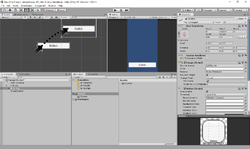

# [atet](https://github.com/atet) / [learn](https://github.com/atet/learn/blob/master/README.md#atet--learn) / [**_unity_**](https://github.com/atet/learn/blob/master/unity/README.md#atet--learn--unity)

[](#nolink)

# Introduction to Unity

**Estimated time to completion: 15 minutes**<br>(excluding waiting times for downloads and installs)

* This introduction to Unity covers what's absolutely necessary to get you up and running
* You are here because you want to **turn your dreams into reality** by developing games or productivity apps
* We will be using Unity to make a simple Android application; advanced material is not covered here

--------------------------------------------------------------------------------------------------

## Table of Contents

### Introduction

* [0. Requirements](#0-requirements)
* [1. Installation](#1-installation)
* [2. New Unity Project](#2-new-unity-project)
* [3. Simple Application](#3-simple-application)
* [4. Playmode Test](#4-playmode-test)
* [5. Building for Android](#5-building-for-android)
* [6. Android Mobile Phone Installation](#6-android-mobile-phone-installation)
* [7. Playing Your First Android Application](#7-playing-your-first-android-application)
* [8. Experiment](#8-experiment)
* [9. Epilogue](#9-epilogue)

### Supplemental

* [Troubleshooting](#troubleshooting)
* [Pro Tips](#pro-tips)
* [Other Resources](#other-resources)

--------------------------------------------------------------------------------------------------

## 0. Requirements

**You do _NOT_ need to know how to program to complete this tutorial**

* An Android mobile phone is required to test your application
* This tutorial was developed on Microsoft Windows 10 and Unity 2019
   * Different versions of Unity may have slightly different menu placement, menu names, etc.
   * Both Unity and Visual Studio Code are also available on Mac OS X and Linux

[Back to Top](#table-of-contents)

--------------------------------------------------------------------------------------------------

## 1. Installation

**Two separate programs must be installed: VSCode and Unity**

1. **Visual Studio Code** (a.k.a. VSCode)
   * Download and install Microsoft Visual Studio Code: <a href="https://code.visualstudio.com/" target="_blank">https://code.visualstudio.com/</a>
   * **Write down where you installed VSCode for a later step**

[](#nolink)

2. **Unity**
   * **Depending on your internet and computer speeds, downloading and installing Unity will take a while (20+ minutes)**
   * You must sign up for a free account with Unity (<a href="https://id.unity.com" target="_blank">https://id.unity.com</a>)
   * Download and install Unity Hub from: <a href="https://store.unity.com/download-nuo" target="_blank">https://store.unity.com/download-nuo</a>
   * Open Unity Hub and sign into you Unity account
   
   [](#nolink)
   
   * On the left-hand menu, select `Installs` then click on the blue `ADD` button on the right, choose the latest version and click on `NEXT`

   [](#nolink)

   * **You must select `Android Build Support`** and click `NEXT`

   [](#nolink)

   * Review the license agreements to begin downloading and installation of Unity
   * After Unity has been downloaded and installed, the installs screen will show a tiny Android icon next to the version that was installed

   [](#nolink)

**After downloading and installing Unity, VSCode, and registering for a Unity account, you should be able to play your first Android application within the next 15 minutes.**

[Back to Top](#table-of-contents)

--------------------------------------------------------------------------------------------------

## 2. New Unity Project

* On the left-hand menu, select `Projects` then click on the blue `NEW` button on the right, and choose the version you installed

[](#nolink)

* Select `2D` (default is a `3D` project), choose your desktop as the location the project will be saved to (Unity will create a new folder), and click on `CREATE`
* Unity will take a few minutes to create your new empty project

[](#nolink)

* After your project is created, you will be presented with the working environment
* **Don't worry about all the different windowpanes and menu options for now, just follow along with the instructions**

[](#nolink)

**We must configure Unity use VSCode as the external code editor**

* Go to menu item `Edit` → `Preferences...` → `External Tools`
* Change `External Script Editor` to where you installed VSCode (navigate to where `Code.exe` is located)

[](#nolink)

[Back to Top](#table-of-contents)

--------------------------------------------------------------------------------------------------

## 3. Simple Application

**Our application will be a button that increments the number shown above it when pressed; we can do this in three simple steps**

1. **Create a Button**
   * On the bottom-left windowpane, right-click on `SampleScene` and select `GameObject` → `UI` → `Button`.

   [](#nolink)

   * **_Where is the button?_** On the bottom-left, double-click on `Button` and the top-left windowpane will zoom to where the button exists
      * **Note**: Just because you can't immediately see an object you just created doesn't mean it doesn't exist in the project

   [](#nolink)

   * We must manually drag the button in the top-left windowpane into where the white outline is
   * This brings the button into the actual view you will see when using the program (this is simulated in the top-center windowpane with blue background)

   [](#nolink)

2. **Create Text Box**
   * On the bottom-left windowpane, right-click on `SampleScene` and select `GameObject` → `UI` → `Text`
   * If the text box doesn't appear within the white outline, click and drag it above the button

   [](#nolink)

3. **Create Script**
   * On the bottom-left windowpane, right-click on `SampleScene` and select `GameObject` → `Create Empty`
   * On the bottom-left windowpane, left-click on the newly created `GameObject`
   * Details of the `GameObject` are seen in the right-hand windowpane, click on `Add Component` and in the small search bar, search for "`script`", and click on `New Script`

   [](#nolink)

   * Name this new script "`script`". Click on `Create and Add`

   [](#nolink)

   * The script is now a component of the `GameObject`
   * We are going to double-click on this newly created script in the bottom-center windowpane and it will open in VSCode

   [](#nolink)

   * If this is your first time opening a file in VSCode, it may download some extras to help read the C# programming language that Unity uses
      * **Once all the extras are finished downloading and installing**, click on the `X` button on the bottom windowpane
   * Unity will provide a default template for every new script:
   
   [](#nolink)
   
   * For now, **just erase the default template code and copy-paste the code below** and save (`CTRL+S`) the file:

   ```cs
   using System.Collections;
   using System.Collections.Generic;
   using UnityEngine;
   using UnityEngine.UI;
   public class script : MonoBehaviour
   {
      public Button myButton;
      public Text myText;
      int myInt;
      void Start() // Start is called before the first frame update
      {
         myInt = 0;
         myButton.onClick.AddListener
         (
               delegate
               {
                  myInt += 1;
                  myText.text = myInt.ToString();
               }
         );
      }
      void Update() // Update is called once per frame
      {
      }
   }
   ```

   * Go back to Unity
      * Unity will take a moment to process the code you just saved in VSCode
   * Clicking on `GameObject` again, you will now see two new boxes appear in the right-hand details windowpane called `My Button` and `My Text` (these were not here before you copy-pasted and saved the script above)
   * You must manually drag-and-drop from the bottom-left pane `Button` to `My Button` and `Text` to `My Text`

   [](#nolink)

[Back to Top](#table-of-contents)

--------------------------------------------------------------------------------------------------

## 4. Playmode Test

* Change the following two settings before playmode testing:
   1. Go to menu `Edit` → `Preferences...` → `Colors` and change `Playmode tint` to a dark red

   [](#nolink)
      
   2. Select `Maximize On Play` so that other windowpanes are hidden during playmode
   
   [](#nolink)

* You can start (and stop) playmode testing by clicking on the top-center ▶ (`Play`) button.

[](#nolink)

* Test your application by pressing the button and watching the number in the text box increment
* Stop playmode when you are done and make sure to save your Unity project
* Don't worry about design elements right now (font sizes, colors, etc.)

[](#nolink)

**You're almost done; let's install this application on your Android device**

[Back to Top](#table-of-contents)

--------------------------------------------------------------------------------------------------

## 5. Building for Android

* Go to menu `File` → `Build Settings...`
* Select `Android` on the bottom-left pane and click `Switch Platform` on the bottom-right
   * Unity will take a few minutes to process this change
* Once done, the Unity icon will appear to the right of `Android`

[](#nolink)

* Once Unity has been changed to build to the Android platform, click on `Build`
* Navigate to your project folder, name your file "`test.apk`", and save the application
   * Unity will take a few minutes to build your application to be ready for Android installation.

[](#nolink)

* Now you have the `test.apk` file needed to install your application on an Android device

[](#nolink)

[Back to Top](#table-of-contents)

--------------------------------------------------------------------------------------------------

## 6. Android Mobile Phone Installation

* Connect your Android phone to your computer to transfer the `test.apk` file over
   * You may have to change the USB connection type to `Media (MTP)` in order to move files from your computer to your phone
   * Through File Explorer on your computer, copy and paste `test.apk` on your phone (I made a folder named "`Unity`" to paste it into)
* Once the file transfer is complete, you can disconnect your phone from your computer
* Android should already have a program named `File Manager` or similar for you to explore files on your device
* Navigate to where you placed `test.apk` on your phone, click on it to install

[](#nolink)

**WARNING**: You should **NEVER** install unverified applications on your Android phone **unless you have made them yourself** and are confident they are safe

* By default, Android will prevent you from installing applications from unknown sources, we will temporarily allow this just to install our application
* Install will be blocked but you can click on `Settings` to go to `Security Settings`
* Once in `Security Settings`, go under `Phone Administration` and click on the checkbox for `Unknown sources`
* A pop up will appear and click on `Allow` applications from unknown sources (in this case, this is the application _you_ just made)

**REMEMBER**: After the tutorial, come back to `Security Settings` to change this back to blocking application installs from unknown sources

[](#nolink)

* Press the back key to go back to File Manager and click on `test.apk` and `INSTALL` on the bottom-right again.
* When the window about Play Protect pops up, select `INSTALL ANYWAYS`

[](#nolink)

* Another popup window will ask for Play Protect scanning, you can click on `DONT SEND`
* After a few moments, your test.apk is now installed as "`New Unity Project`"
* Click on `OPEN` on the bottom-right to launch your application

[](#nolink)

[Back to Top](#table-of-contents)

--------------------------------------------------------------------------------------------------

## 7. Playing Your First Android Application

* If you launched your application directly after installing, you'll get the Unity splash screen and then be presented with your application
   * If you did not launch after install, find "`New Unity Project`" on your device
* Tap on the button and watch the numbers increment!
   * The button and text box may be tiny, **but it should work**

[](#nolink)

### **Congratulations! You made a fully-functioning, stand-alone mobile application**

[Back to Top](#table-of-contents)

--------------------------------------------------------------------------------------------------

## 8. Experiment

* _Didn't like how small the button and text were?_ **Make them larger.**
* _Want more buttons and text boxes?_ **Make more!**

[Back to Top](#table-of-contents)

--------------------------------------------------------------------------------------------------

## 9. Epilogue

**Now that you have a feel for the workflow of using Unity, the possibilities are endless**

* Design innovative and fun games
* Master the C# programming language
* Make productivity apps to help you succeed

**Clean Up**

* If you make changes to this application, you should uninstall the current version first before installing the updated version
   * On your Android device, go to `Settings` → `DEVICE` → `Apps`, find and select "`New Unity Project`" and click on `Uninstall`
* You may want to erase the `test.apk` you made or start numbering these files with some sort of versioning system as you make changes, e.g. `test_V2.apk` or `test_2019-12-08.apk`

**REMINDER**: Go back to `Security Settings` to change back to blocking application installs from unknown sources

[Back to Top](#table-of-contents)

--------------------------------------------------------------------------------------------------

## Troubleshooting

Issue | Solution
--- | ---
Where is the button/menu item/etc.? | There may be major differences between versions of Unity: if you upgrade in the middle of development, you could break your application
I made some changes in Unity but it didn't seem to "Save" them | Any changes when Unity is in "Playmode" are not saved; make these two changes in the [4. Playmode Test](#4-playmode-test) section to ensure that doesn't happen

[Back to Top](#table-of-contents)

--------------------------------------------------------------------------------------------------

## Pro Tips

* **Q: Why are we developing in Unity for an Android application, couldn't we have just used Android Studio?**
   * A: Unlike Android Studio, a Unity project can also be built for iOS, PS4, Xbox One, Windows, MacOS, etc. 
* You will frequently go back and forth between manipulating objects in the Unity's graphical user interface and programming in Visual Studio Code
* Consider having devices that are solely for testing that are not linked to your social media, email accounts, cellular SIM card, etc.

> "_Unity is.. peculiar..._"
>
> Veteran software engineer colleague learning Unity

[Back to Top](#table-of-contents)

--------------------------------------------------------------------------------------------------

## Other Resources

* This tutorial was developed on Microsoft Windows 10, Unity 2019.2.15f1, and Visual Studio Code 1.38.1
   * Different versions of Unity may have slightly different menu placement, menu names, etc.

Description | Link
--- | ---
Official Unity Tutorials (Free) | <a href="https://learn.unity.com" target="_blank">https://learn.unity.com</a>
GameDevTV 2D Unity Course (Paid) | <a href="https://www.gamedev.tv/p/complete-unity-developer-2d" target="_blank">https://www.gamedev.tv/p/complete-unity-developer-2d</a>
Official Unity Terms of Service (Unity is free until you start making money) | https://unity3d.com/legal/terms-of-service/software

[Back to Top](#table-of-contents)

--------------------------------------------------------------------------------------------------

<p align="center">Copyright © 2019-∞ Athit Kao, <a href="http://www.athitkao.com/tos.html" target="_blank">Terms and Conditions</a></p>